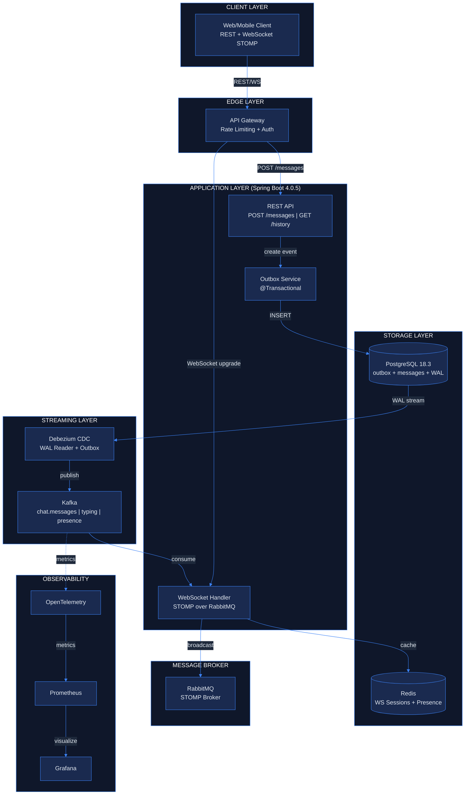

# Jroom36

File Storage Service with REST API, WebSocket and MinIO

Demo UI(Figma make): https://help-marsh-18266473.figma.site/


## Tech Stack
### App
- Java 25
- Spring Boot 4.0.5
- PostgreSql 18.3
- MinIO(+tux for big file processing)
- Maven
- Docker Compose

### For chat part
- **REST API** — send new messages, get message history per room
- **WebSocket (STOMP) over RabbitMQ** — real-time updates: typing status, online/offline presence, room changes
- **Redis** — cache active WebSocket connections and user sessions
- **Outbox Pattern + Debezium CDC** — capture message changes from PostgreSQL WAL (exactly-once delivery)
- **Apache Kafka** — distribute messages and events to consumers (WebSocket push, analytics, storage)
- **OpenTelemetry + Prometheus + Grafana** — monitor system health, subscribed to Kafka metrics



  
## Quick Start

### Prerequisites

- Docker & Docker Compose
- Make
- sdkman is used to manage Java

### Run with Make
```bash
# Build and start all services
make build
make start

# Check application status
make status

# View logs
make logs

# Stop services
make stop

# Clean everything
make clean
```

### API Endpoints

#### Check version
curl http://localhost:8080/api/v1/version
